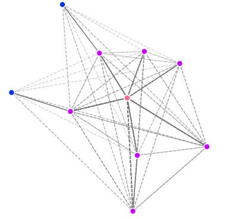

 

CRXN stands for **C**ommunity **R**un e**X**pansive **N**etwork. It's a computer network run by the _community for the community_.
We are a dual-stack IP-based network supporting both IPv4 and IPv6. We are focused on having a network that is accessible to all,
reliable in terms of having redundant links and diverse. The first part means that we are welcome to anyone who wants to join, the
second part means that we focus on having a lot of links between adjacent routers such that if one is to fail there exists a fallback
(in the case where the route is only available through said router - if there are more routers then this is mitigated). We also strive
to have diverse links - this means linking over the Internet whether it be clearnet or via an overlay network such as Yggdrasil or CJDNS
or in the best case creating physical links.

We aim to create a more open Internet available to everyone and a place to learn about IP routing and networking in general.

We don't use any particular tooling, the only thing that is standard is the IPv4 and IPv6 part. What tunnelling software, physical
mediums or routing daemon you choose to use is up to you - this falls in line with our _open_ ethos.

---

## About the network

### Ranges

The subnets that we use so far are the below private ranges.

* For **IPv4** we are running on the `10.0.0.0/8` range.
* For **IPv6** we are running on the `fd00::/8` range.

IPv4 note: If we run out we will simply use more private ranges but we will keep out the `192.168.0.0/16` range such that home networks (sane ones) will not have any clashes.

### The state of the network

The network is currently at a mere ~10 nodes with a few services being run over the network such as Mumble and NFS. The only routing
daemon being used at this moment is babel and for tunnelling we are using fastd to establish VPN connections at an L2 layer between sites.

In terms of transit we run fastd over clearnet, Yggdrasil and CJDNS.

You can view the babel part of the network on the [live router map](http://deavmi.assigned.network:4444).

## Getting started

### Joining the network

There is a tutorial (which is done for the most part) [here](peering.md) which will help you get connected onto the inter-network.
