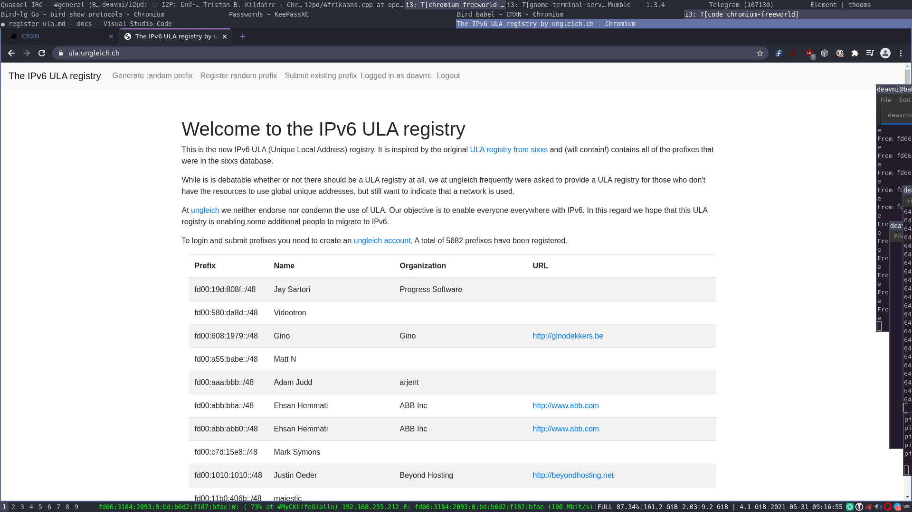
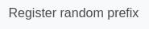
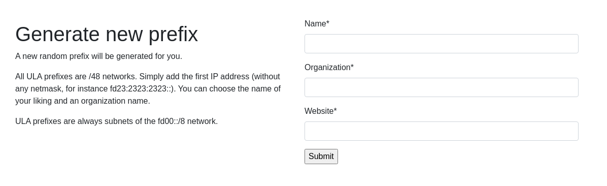
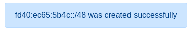

Registering a subnet
====================

Before we get started with configuring any sort of routing you first need to get yourself a network allocated to yourself.

## Generating a /48 ULA

We highly recommend you register a new `/48` ULA on the [Ungleich ULA registry](https://ula.ungleich.ch/) - this way we can ensure that the ULA is stored in a global database to prevent clashes (even though the probability is low).

Firstly register a new account with them and you should see the homepage as follows then:

Then go to the "Register random prefix" section:

On this page fill in the fields, for the `URL` field put `http://deavmi.assigned.network/projects/crxn`. As for the `Organization` set that to `CRXN` and then for the `Network` section set that to be whatever you want to name your network (remember this as we will need it later).

After filling this in then hit submit and you should see a blue pop up with your allocation, save this, this is **very important**.

Now you have successfully allocated yourself a /48 ULA on Ungliech, `fd40:ec65:5b4c::/48`, next we will register it on the CRXN registry.