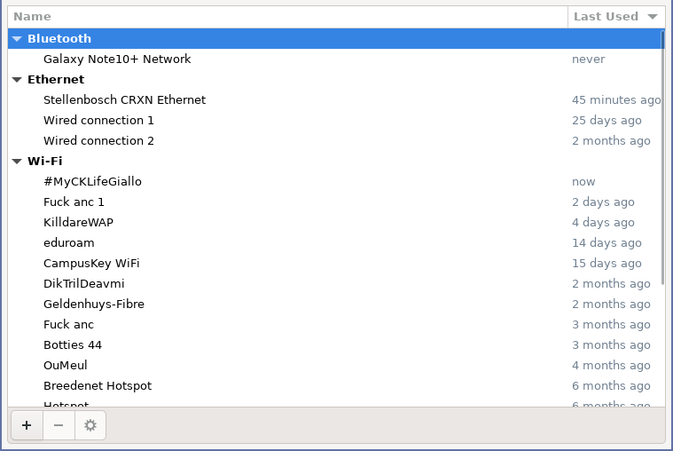
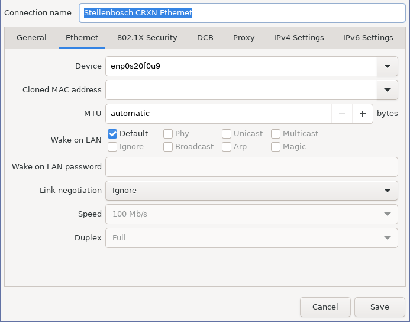
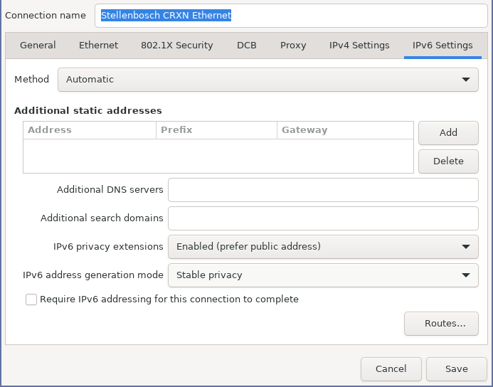
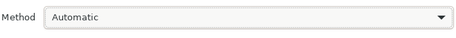
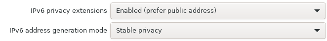
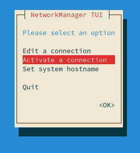
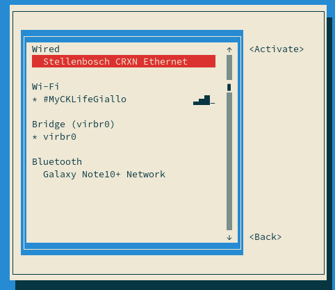

SLAAC
=====

Configuring your hosts for automatic IP network and address assignment, DNS and routing is very easy.

**Note::** This tutorial is written for those who have setup Radv already.

## NetworkManager-based systems

For NetworkManager-based systems do the following. Open up `nm-connection-editor` and you should have a screen appear like this:

Then double click on the wifi or ethernet connection you have active of which connects you to the same LAN as your router and you should see a window like this popup:

Then go to the `IPv6` tab and you should see this:

Now make sure that this part is set to `Automatic`:

And then for the bottom two parts you can choose whatever option you want in these dropdowns:

Once you have configured that, then hit save and close all those windows:

What you want to do now is to open `nmtui` (in your terminal) and reactivate that connection, first go to _Activate a connection_:

Now reactivate the connection. You can do this by deactivating it and activating it again (unplugging and replugging won't reactivate it - it doesn't reload the profile).

---

And that is it, now you should be connected to CRXN on your laptop via your router.